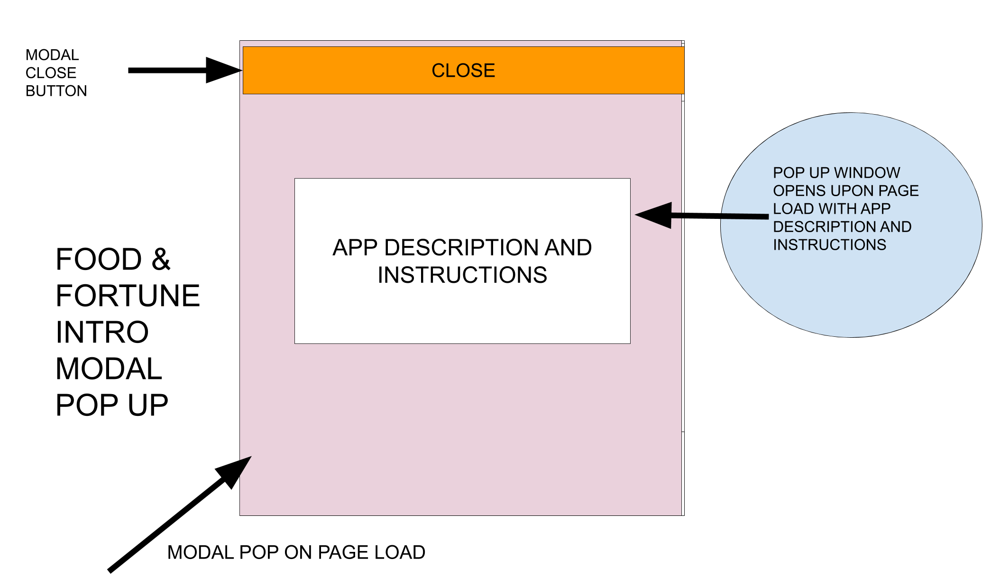
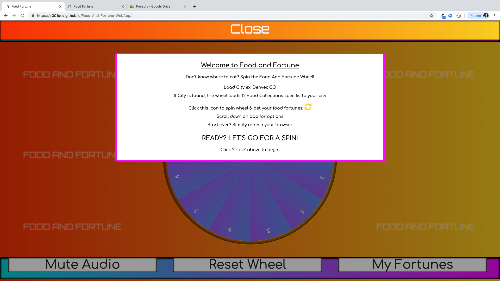
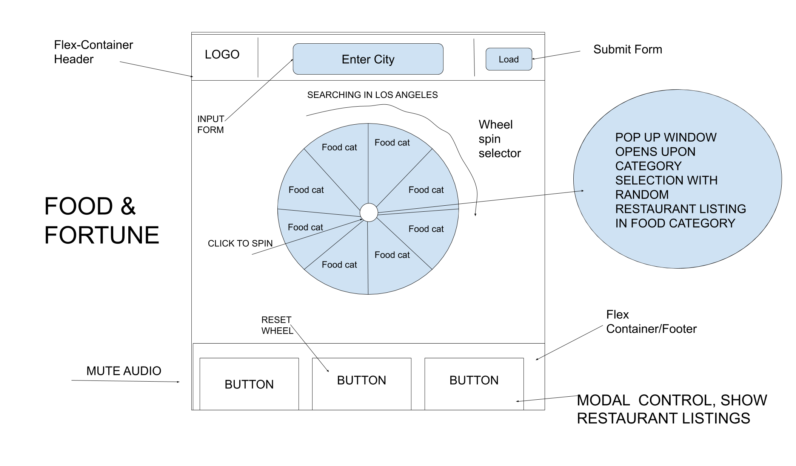
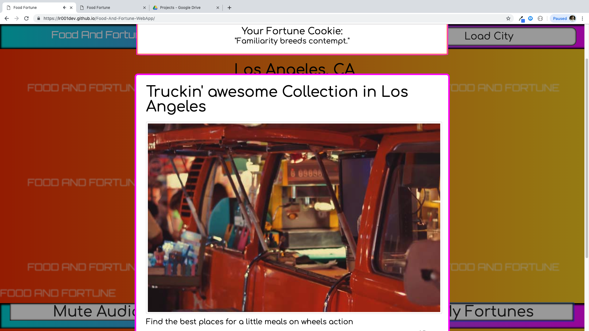
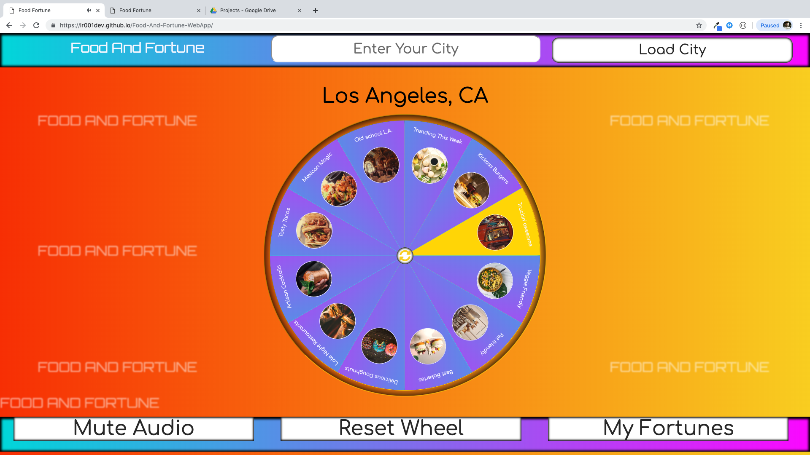

# Food Fortune Web App

Food And Fortune is a random restaurant chooser application based on specialized food collections specific to a city. The app is based on the Zomato Restaurant and Fortune Cookie API. Users load a city and receive random selections of restaurants to guide them to their next food destination. The app also displays 1 Fortune from the Fortune Cookie API with each search.

Spin the Food Fortune wheel and be shown your future fortune and eating spot!

# Technologies Used:

HTML5, CSS, Javascript, Jquery, touchmove event listener, Zomato API, Fortune Cookie API, HTML5 Audio for Music & Sound Fx.

# Current Bugs:

1-There are instances where the API will load no Food Collections for a city due to returning zero results for that city. Perhaps because API is still fairly new.

2-There are cases where the API will return no restaurant results after it has landed on a Food Collection when it seems that there should be a result. API miss?

# Solve
Must create logic to handle these cases to inform the user what has happened. In case #1, we can replace the missing Food Collections with more general food categories that aren't specific to a city that is available through the Zomato API. In case #2, prompting the user that there was a miss or making an additional API call under the radar to find a backup selection.

# Workflow on Trello:
https://trello.com/invite/b/sK7Au91i/e4be659f95847372cd717149e8fc3e6b/sei-food-fortune

# Demo

https://lr001dev.github.io/Food-And-Fortune-WebApp/

# Wireframes

//////Intro Modal Pop Up/////
//////On Page Load//////////

//////App Main View /////

//////Automatic Modal Pop Up////////////
//////Show Restaurant Listing //////////

