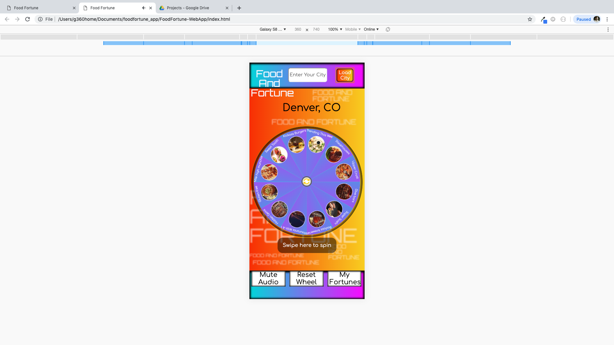

# Food Fortune Web App

Food And Fortune is a random restaurant chooser application based on specialized food collections specific to a city. The app is based on the Zomato Restaurant and Fortune Cookie API. Users load a city and receive random selections of restaurants to guide them to their next food destination. The app also displays 1 Fortune from the Fortune Cookie API with each search.

Spin the Food And Fortune Wheel and be shown your future fortune and eating spot!

# Technologies Used:

HTML5, CSS, Javascript, Jquery, touchmove event listener, Zomato API, Fortune Cookie API, HTML5 Audio for Music & Sound Fx.

# Current Bugs:

1-There are instances where the API will load no Food Collections for a city due to returning zero results for that city. Perhaps because API is still fairly new.

2-There are cases where the API will return no restaurant results after it has landed on a Food Collection when it seems that there should be a result. API miss?

3-Reset Wheel triggers unwanted actions if user clicks before loading a new city. Works fine after the fact.

# Solve
Must create logic to handle these cases to inform the user what has happened.

In case #1, we can replace the missing Food Collections with more general food categories that aren't specific to a city that is available through the Zomato API.

In case #2, prompting the user that there was a miss or making an additional API call under the radar to find a backup selection.

In case #3, Restructure #wheelReset event listener to be setup within the class SearchCity within the createWheelFoodCategories method by using bind/unbind jquery methods to enable or disable click at appropriate time.

# Workflow on Trello:
https://trello.com/invite/b/sK7Au91i/e4be659f95847372cd717149e8fc3e6b/sei-food-fortune

# Wireframes

////// Intro Modal Pop Up On Page Load /////

////// On Mobile /////

////// App Main View /////

////// On Mobile /////

//////Automatic Modal Pop Up Show Restaurant Listing////////////

////// On Mobile /////

# Demo

https://lr001dev.github.io/Food-And-Fortune-WebApp/
